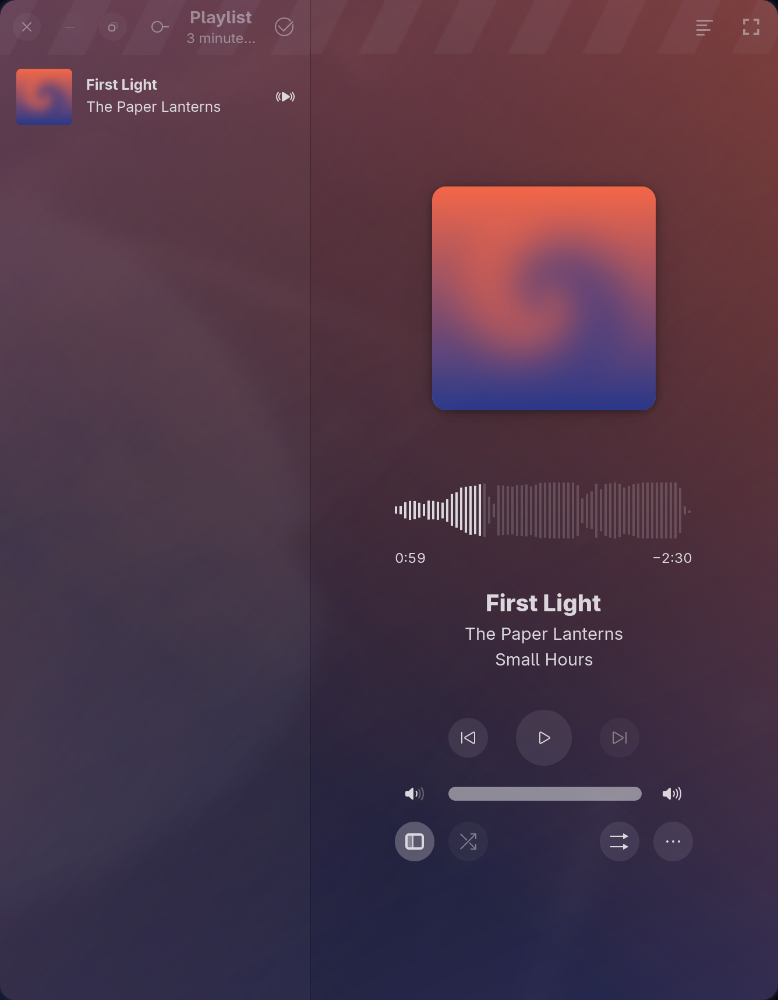

Aubade
======

A local music player for GNOME, with time-synced lyrics.

*Screenshots use a demo track with synthetic artwork and placeholder lyrics.*

Aubade plays the music already on your disk. It does not stream, it does not
manage a library, and it does not need an account. Point it at a folder and it
plays.

Features
--------

- **Time-synced lyrics.** Aubade reads sidecar `.lrc` files sitting next to your
  audio and scrolls them in time with playback, highlighting the current line.
  Songs without lyrics simply don't show the button.
- Gapless playback with ReplayGain support
- Waveform seeking
- MPRIS integration, so media keys and desktop widgets work
- Adaptive UI that works from a narrow column to a full window

Lyrics
------

Place an `.lrc` file next to the audio file, sharing its name:

    a-little-more-time.opus
    a-little-more-time.lrc

Aubade also accepts `a-little-more-time.opus.lrc`, and matches the extension
case-insensitively.

Standard LRC is supported: `[mm:ss.xx]` and `[mm:ss.xxx]` timestamps, repeated
timestamps on a single line, `[offset:]` correction, and metadata tags. Enhanced
LRC word-level tags are stripped and sync stays line-level. Files with no
timestamps are treated as having no synced lyrics.

Building
--------

Aubade builds with meson and cargo:

    meson setup builddir
    ninja -C builddir
    ninja -C builddir install

Build dependencies on Fedora:

    sudo dnf install gtk4-devel libadwaita-devel gstreamer1-devel \
        gstreamer1-plugins-base-devel gstreamer1-plugins-bad-free-devel \
        blueprint-compiler cargo

To run a development build without installing it:

    meson setup builddir -Dprofile=development
    ninja -C builddir
    meson devenv -C builddir ./src/debug/aubade

The development profile uses the application id
`io.github.workbydivyanshu.Aubade.Devel`, so it can be installed alongside a
release build.

Debugging
---------

    RUST_LOG=aubade=debug ./builddir/src/debug/aubade

License
-------

Aubade is licensed under the GPL-3.0-or-later. See [LICENSES](./LICENSES).

Aubade is a fork of [Amberol](https://gitlab.gnome.org/World/amberol) by
Emmanuele Bassi.
